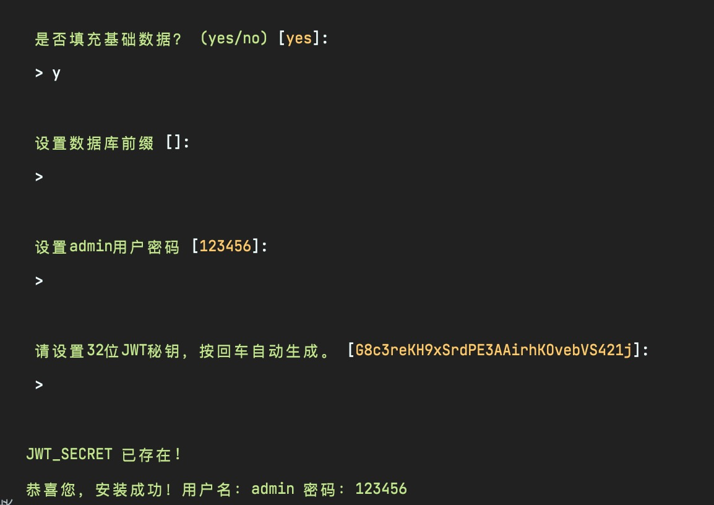

## USaaS Admin 插件式快速开发框架
## 开发中，生产勿用
### 基于Vue3+、Vite、Ant Design,以插件形式开箱即用.

### 技术栈

|      版本       | 技术栈  | 备注 |
|  ----------      | -------------  | -------------  |
| 后端PHP版  | PHP8+、Swoole4.5+、hyperf2.2+、MySql5.7+  | 研发中，正式环境请勿使用 |
| 后端NodeJs版  | node14+typescript4.3.5+nestjs8.0+MySql5.7   | 待发布|
| 前端  | Vue3+、Vite、Ant Design | |

## 安装命令

### 一、Docker 下开发 (已有hyperf环境的跳过此步骤)

假设您的本机环境并不能达到 Hyperf 的环境要求，或对于环境配置不是那么熟悉，那么您可以通过以下方法来运行及开发 Hyperf 项目：

- 启动镜像

可以根据实际情况，映射到宿主机对应的目录，以下以 `/workspace/skeleton` 为例

> 如果 docker 启动时开启了 selinux-enabled 选项，容器内访问宿主机资源就会受限，所以启动容器时可以增加 --privileged -u root 选项

```shell
docker run --name uu-admin \
-v /workspace/skeleton:/apps/admin \
-p 9501:9501 -it \
--privileged -u root \
--entrypoint /bin/sh \
registry.cn-zhangjiakou.aliyuncs.com/eic/common:hyperf-8
```

### 二、首先确保安装好了hyperf框架，并且数据库连接设置正确。
1、在已有hyperf项目上，安装admin插件或全新安装hyperf框架
- <font color=red>已有Hyperf项目安装可以忽略这一步。</font>
```bash
composer create-project hyperf/hyperf-skeleton
```

<font color=red>配置好数据库（必须）</font>，然后执行下面安装命令
2、安装admin插件
```bash
composer require uu/admin
```
3、执行安装命令
```php
php bin/hyperf.php usaas:install
```




## 更新计划

[comment]: <> (|      模块       | 介绍  | 完成状态  | 预计发布日期 |)

[comment]: <> (|  ----------      | -------------  | -------------| -------------  |)

[comment]: <> (|  用户模块|登录注册、token刷新            |已完成| 2021-09-13)

[comment]: <> (|  用户管理|增加、编辑、搜索、删除、角色授权        |已完成 | 2021-09-13)

[comment]: <> (|  系统配置|增加、编辑、搜索、删除、动态自由组合生成配置表单| 已完成| 2021-09-13)

[comment]: <> (|  部门管理|增加、编辑、搜索、删除| 已完成| 2021-09-13)

[comment]: <> (|  菜单管理|增加、编辑、搜索、删除| 已完成| 2021-09-13)

[comment]: <> (|  角色管理|增加、编辑、搜索、删除、权限管理|已完成| 2021-09-13)

[comment]: <> (|  权限管理|增加、编辑、搜索、删除、配置权限|已完成| 2021-09-13)

[comment]: <> (| 模型管理|通过模型管理创建数据表，生成虚拟路由,支持动态表单、动态列表、动态过滤器等，无需写任何代码，快速生成所需要的增删改查后台|未完成| 2021-10-20)

[comment]: <> (| 上传管理|前端直传（支持阿里云、腾讯云）|未完成| 2021-09-30)

[comment]: <> (|  Low code|拖拽生成后台页面|未完成| 2021-10-30)

[comment]: <> (| 应用插件| 系统内置常用的插件，如短信、文章、微信公众号、活动等 |未完成| 2021-10-20)

[comment]: <> (| SaaS租户后台|   |未完成| 2021-10-20)

[comment]: <> (| SaaS数据源管理|多数据库模式|未完成| 2021-10-30)

- [x] 用户模块（登录注册、token刷新）
- [x] 用户管理（增加、编辑、搜索、删除、角色授权）
- [x] 系统配置（增加、编辑、搜索、删除、动态自由组合生成配置表单）
- [x] 部门管理（增加、编辑、搜索、删除）
- [x] 菜单管理（增加、编辑、搜索、删除）
- [x] 角色管理（增加、编辑、搜索、删除、权限管理）
- [x] 权限管理（增加、编辑、搜索、删除、配置权限）
- [ ] 模型管理（通过模型管理创建数据表，生成虚拟路由,支持动态表单、动态列表、动态过滤器等，无需写任何代码，快速生成所需要的增删改查后台）
- [ ] 上传管理（前端直传（支持阿里云、腾讯云））
- [ ] Low code 拖拽生成后台页面
- [ ] 应用插件（系统内置常用的插件，如短信、文章、微信公众号、活动等）
- [ ] SaaS租户后台（管理多租户账户，数据源配置等）
- [ ] SaaS数据源管理（多数据库模式）

## 文档地址

### 暂无

## 演示地址：

### 暂无

## 预览图片
系统概览


菜单管理


角色管理


系统配置


配置项系统维护


